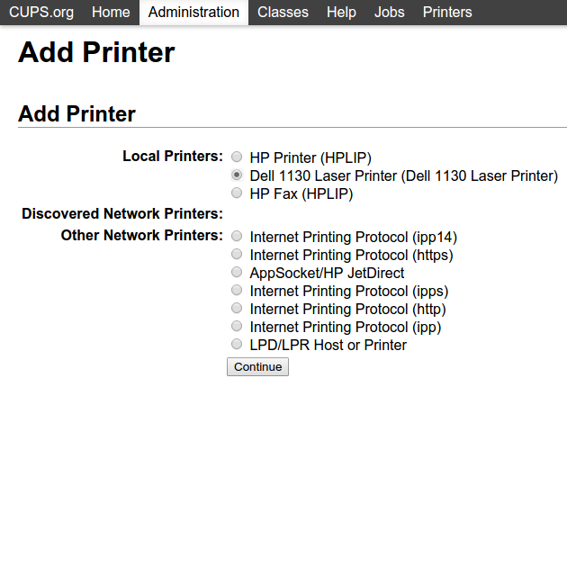
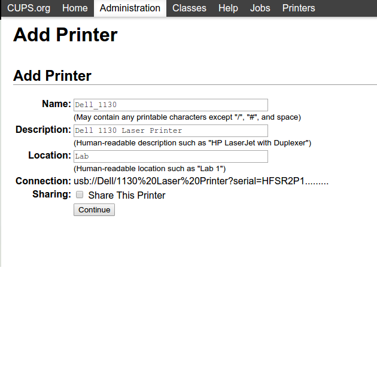
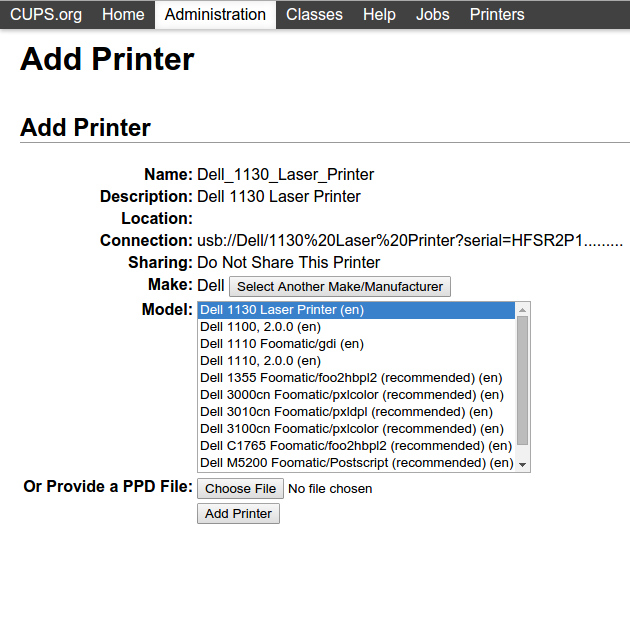

# Installation

Go to the [Releases Section](https://github.com/martensms/printer-driver-dell1130/releases)
and download the driver for your system architecture. The driver releases should work with
CUPS on all Debian and Ubuntu variants.

After installation of the package, follow the Configuration Guide.


# Setup

Open your Web Browser and navigate to [http://localhost:631/admin](http://localhost:631/admin), then click on *Add Printer*.








# Error and status codes (LED signals)


## Paper-Jam LED

* Orange (on): A paper jam has occured.


## Online/Error LED

* Green (on): On-line and ready.

* Green (blinking): Receiving data.

* Green (rapid blinking): Printing data.

* Red (on): The cover is open; Paper tray empty; Major error occured (needs technical service).

* Red (blinking): Minor error occured; waiting for error to be cleared.


# Toner Refill

Currently the Fixmaker from the Samsung ML1915 isn't ported to Linux,
so you have to have a Windows OS for toner refills. Sorry :-(

* Organize a Toner Refill Kit and Refill the Toner

* Run **/debug/fixmaker-ml1915/usbprns2.exe ML1910_V1.001.00.83.fls** to reset the cartridge and the printer chipset.


# License

```text

      DO WHAT THE FUCK YOU WANT TO PUBLIC LICENSE 
                    Version 2, December 2004 

 Copyright (C) 2012-2015 Christoph Martens

 Everyone is permitted to copy and distribute verbatim or modified 
 copies of this license document, and changing it is allowed as long 
 as the name is changed. 

            DO WHAT THE FUCK YOU WANT TO PUBLIC LICENSE 
   TERMS AND CONDITIONS FOR COPYING, DISTRIBUTION AND MODIFICATION 

  0. You just DO WHAT THE FUCK YOU WANT TO.

```

